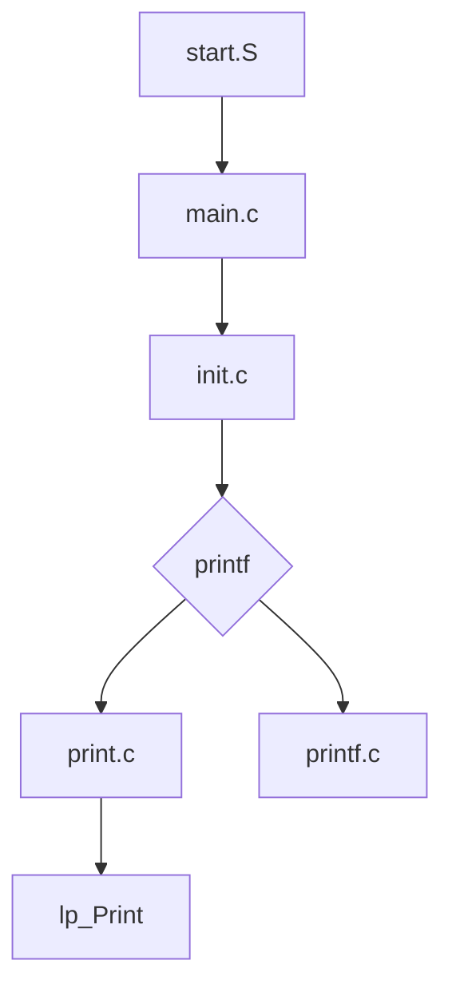
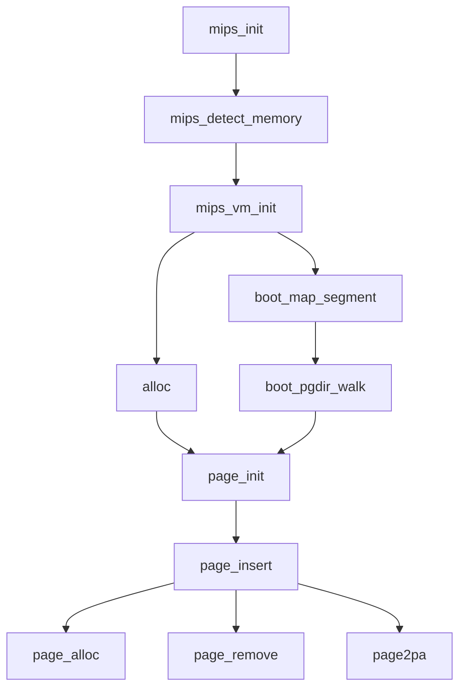
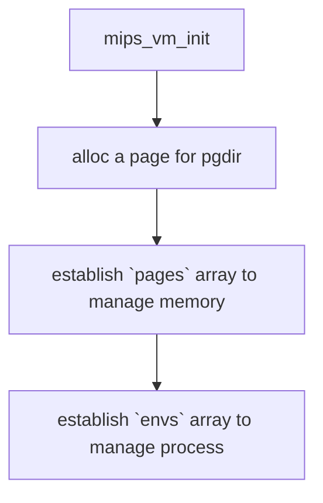
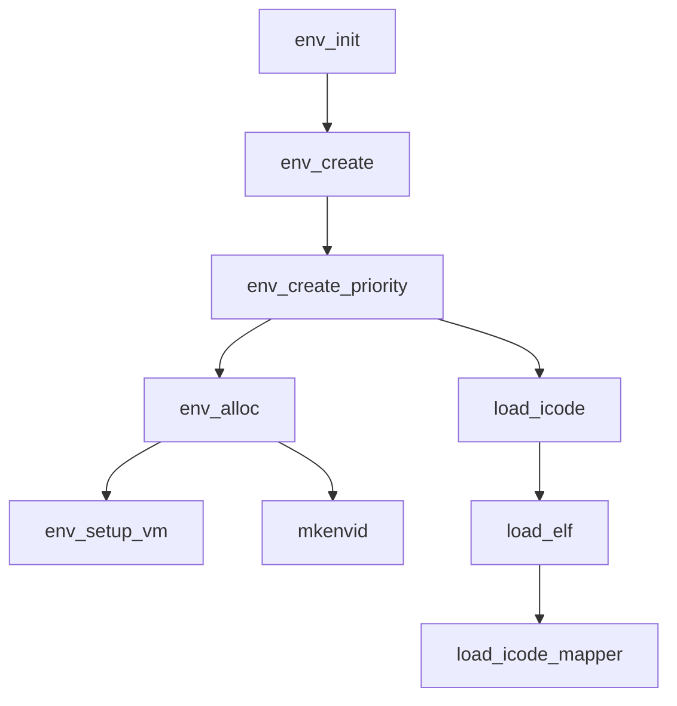
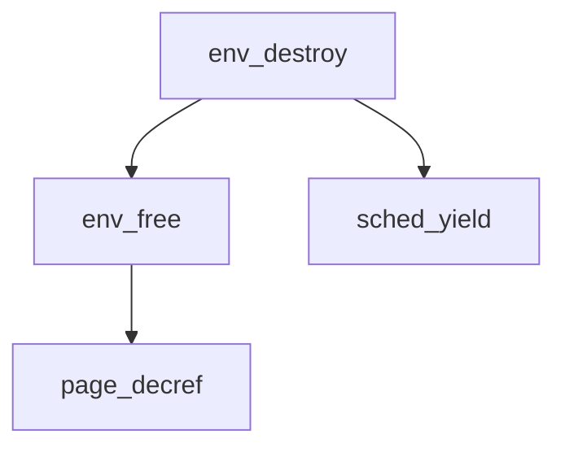
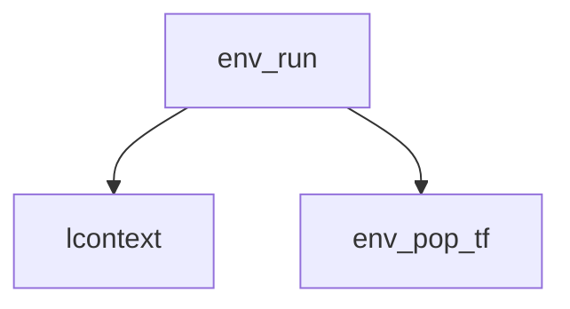
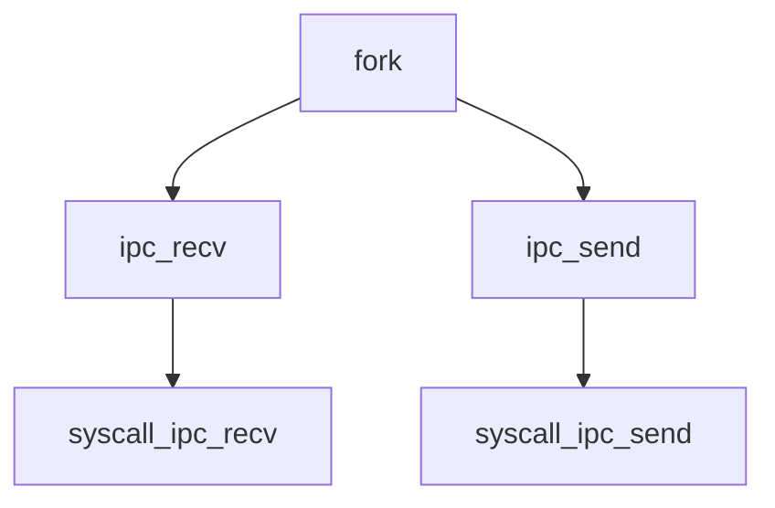
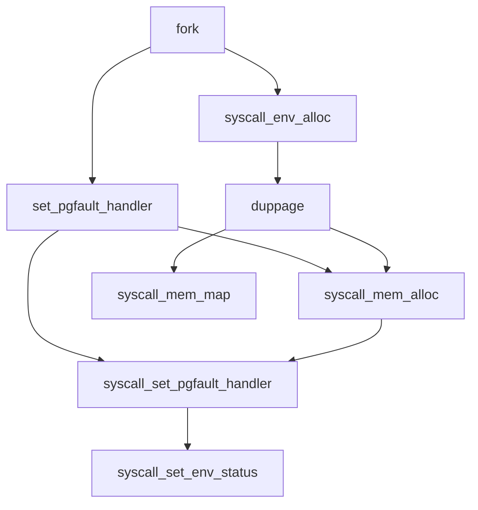
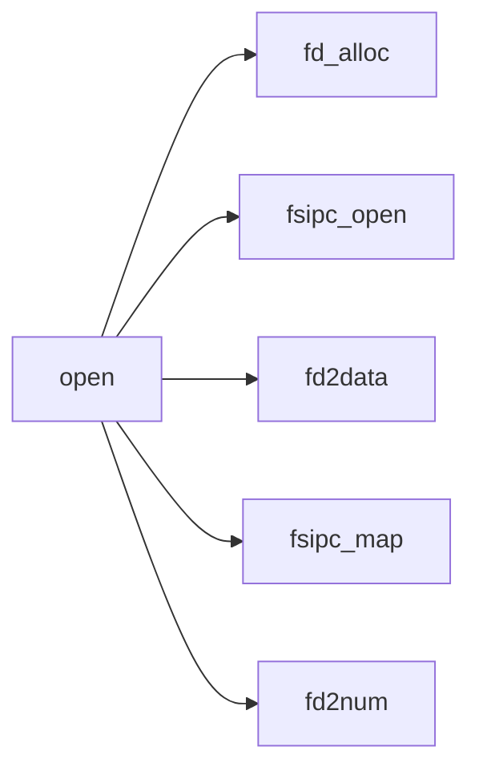
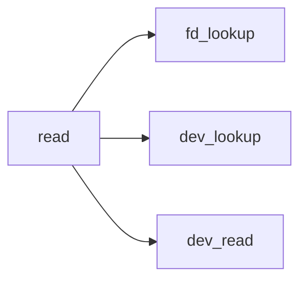

# MOS Operating System

> There may be some display mistakes due to GitHub Markdown interpreter, so you can download and read this tutorial.

**The full text has a total of `10536` words, and the recommended reading time is `2~3` hours.**

`MOS` is the name of this Linux kernel operating system. This project is divided into 5 labs from basic bootstrap to file system. Hope you can enjoy it!

# Lab1 Summary

## Process combing



## File and call analysis

### include.mk

* location:`.`
* use:
  * define the commands used in Makefile
    * `CROSS_COMPILE`:path of cross compiler
    * `CC`
    * `LD`
    * `CFLAGS`


### readelf.c

* `int readelf(u_char *binary, int size)`
* location:./readelf
* use:
  * parse an LITTLE-ENDIAN elf file and print info of sections


### kerelf.h

* location:./readelf

* use:

  * define structures to parse elf file

    * `Elf32_Ehdr`:ELF Header

    * `Elf32_Shdr`:Section Header
    * `Elf32_Phdr`:Program Header


### main.c

* `int main(int argc,char *argv[])`
* location:./readelf
* use:
  * get filename from command line and call readelf func to parse it


### scse0_3.lds

* location:./tools

* use:

  * set the start address of `.text`/`.data`/`.bss` for link

    > control the address where kernel should be loaded


### start.S

* location:./boot
* use:
  * set stack pointer(sp) at `0x80400000`
  * jump to `main`(in ./init)


### print.c

* location:./lib
* use:
  * hold `lp_Printf()` which is core of print function


### printf.c

* location:./lib
* use:
  * call `lp_Print()` to realize print function


### mips_init()

* `void mips_init()`
* location:./init/init.c
* use:
  * call printf to show init process


## FAQ

* The use of C language variable length parameters

  * Define a variable of type `va_list` as a pointer to a variable length parameter.
  * Use the `va_start` macro to initialize the variable to point to the first variable length parameter.
  * Use `va_arg` to return variable length parameters. When there are multiple variable length parameters, you can get them one by one.
  * Use the `va_end` macro to end parameter acquisition.

  ```c
  int sum(char* msg, ...)
  {
      va_list vaList;
      va_start(vaList, msg);
      while((step = va_arg(vaList, int)) != 0) {
          // TODO
      }
      va_end(vaList);
  }
  ```

  

* How to interact with the C file after the assembly file is compiled

  * Assembly files (.S) will also generate .o files after compilation.

    > `.s` does not require preprocessing when compiling, `.S` requires preprocessing.

  * The function of C language is compiled into assembly and will generate a label with the same name as the function, so use `jal` to call assembly -> C.

    ```assembly
    jal main
    ```


## Guidebook extract

* `bootloader` is mainly responsible for hardware initialization, but also prepares for software startup. (For example, read the kernel image from disk to RAM)

* `gxemul` guarantees that all the functions of `bootloader` have been completed, you can load the kernel file directly and then start the kernel.

* The startup process under `gxemul`: load the kernel into the memory (set the parameters manually, the loading is done by `gxemul`), and then jump to the entrance of the kernel (completed by the assembly function).

* The preprocessing of the C language adds the contents of the header file to the source file

* Under x86, `callq` is an instruction to call a function

* `ELF` includes executable files, object files, files used by libraries (similar to the `PE` file format under Windows)

* `file` command can get the type of file

  ```shell
  file a.o
  ```

* The information of $Segment$ is used at runtime, and the information of $Section$ is used during program compilation and linking.

  * When linking, each part of the target file is regarded as a collection of `section`.
  * At runtime, the target file (**may** is the same file as the former) is regarded as a collection of `segment`.

* Assuming that `binary` is the address of the file header of the `ELF`, and `offset` is the offset of the `Section Header Table`, then $binary+offset$ is the entry address of the header table.

* ${MemSiz}\geq{FileSiz}$ is always established, such as uninitialized global variables. Only the memory occupied by the executable file (MemSiz) is recorded in the executable file, but there is no data in the file. At this time, $MemSiz>FileSiz$

* `kseg1` does not go through the cache and is generally used to access external devices.

* `kseg0` uses cache, but does not use MMU.

* `.data` stores global variables and static variables that have been initialized by humans, while `.bss` stores global variables and static variables that have been initialized by default (uninitialized).

  ```c
  char c ='a'; // store in .data
  int a; // store in .bss
  ```

  > Other local variables are stored on the stack

* `fp` and `s8` are the same register

* Position-independent code: code that can be loaded directly without relocation

  > When calling position-independent code, `gp` (global/content pointer) is not saved.

# Lab2 Summary

## INIT PROCESS



### mips_init()

* `void mips_init()`
* Location:init.c
* use:
  * main function to initialize mips system


### mips_detect_momery()

* `void mips_detect_memory()`
* location:pmap.c
* use:
  * manually set system's memory attributes(`maxpa`/`basemem`/`npage`/`extmem`)


### mips_vm_init()

* `void mips_vm_init()`

* location:pamp.c

* use:

  * set up two_level page table

  * alloc `a page` for `pgdir`

  * establish `pages` array and the size is $npages*sizeof(struct\ Page)$

    > be cautious that the size is not for `POINTER` but for a `struct` itself

  * establish `envs` array and the size is $NENVS*sizeof(struct\ Env)$




### alloc

* `static void *alloc(u_int n, u_int align, int clear)`
* location:pmap.c
* use:
  * alloc **aligned n** bytes of memory
  * If `clear` is set, alloced_mem will be set zero.
  * `end[]` is meaningful only when using `end` as an address.(`0x8040 0000`:the baseline to alloc pages)


### boot_map_segment

* `void boot_map_segment(Pde *pgdir, u_long va, u_long size, u_long pa, int perm)`
* location:pmap.c
* use:
  * set pgtable entries to map $[va, va+size)$ to $[pa,pa+size)$
  * $pgtable\ entry = PA|PERM$


### page_init

* `void page_init(void)`
* location:pmap.c
* use:
  * establish free page list
  * After `mips_vm_init`, some pages is already taken. So update those pages' ref before build list.


### page_alloc()

* `int page_alloc(struct Page **pp)`
  * `pp` is a `pointer to pointer`, so we need to assign to `*pp`
* location:./mm/pmap.c
* use:
  * alloc a page from `page_free_list`


### pgdir_walk()

* `int pgdir_walk(Pde *pgdir, u_long va, int create, Pte **ppte)`

  * `pgdir`:the virtual address for thr first entry of page directory
  * `*ppte`:used as return value

* location:./mm/pmap.c

* use:

  * find the page table entry for `va`

  > cannot assure the page table entry has corresponding `pa` for `va`


### page_insert()

* `int page_insert(Pde *pgdir, struct Page *pp, u_long va, u_int perm)`

* location:./mm/pmap.c

* use:

  * make `va` map at a given physical page `pp`
  * similar effects like `boot_map_segment`

  > when calling this function without changing `pp`, it's to change the `perm` of page table entry, and that's why the `tlb` needs to be rewritten.


### page2pa()

* `static inline u_long page2pa(struct Page *pp)`

  * `inline` can make the function stays in memory so we can save time for stack-push-pop when calling it.

* location:./include/pmap.h

* use:

  * return the physical address of `*pp` by calculating `ppn` of it.

    > in `page2ppn()`, we excute `pp-pages` to ge ppn.


### va2pa()

* `static inline u_long va2pa(Pde *pgdir, u_long va)`

* location:./include/pmap.h

* use:

  * look up `pgdir` and `pgtable` to find the `pa` of `va`

  > this function can translate non-kernel address (different from `PADDR`)


## Structure & Macro

### Page

* type:struct

* location:./include/pmap.h

* fields:

  * pp_link

    * type:struct,`LIST_ENTRY(Page)`
    * fields:
      * `*le_next`
      * `**le_prev`

    

  * pp_ref


### LIST_HEAD(name, type)

* type:macro

* use:

  * define a head pointer of **type** with **name**

    > `name` is the name of struct

  * then we can use `struct name xxx` to define a variable

    > the variable is an `instance` rather than a `pointer`


### LIST_HEAD_INITIALIZER(head)

* type:macro
* use:
  * `NULL` to be assigned to a list head pointer


### LIST_ENTRY(type)

* type:macro
* use:
  * define a list entry's `pp_link` field


### LIST_EMPTY(head)

* type:macro
* use:
  * use `lh_first` field of `LIST_HEAD` to judge whether a list is empty or not


### LIST_FIRST(head)

* type:macro
* use:
  * return `lh_first` i.e. the pointer of first element in list


### LIST_NEXT(elm, field)

* type:macro
* use:
  * return `le_next` i.e. the pointer of next element


### LIST_FOREACH(var, head, field)

* type:macro
* use:
  * iterate list from start to end with **pointer**


### LIST_INIT(head)

* type:macro
* use:
  * empty the list by assigning `NULL` to `lh_first`(pointer despite element)


### LIST_INSERT_AFTER(listelm, elm, field)

* type:macro

* use:

  * insert `elm` after `listelm` by changing `field`

  ```c
  LIST_NEXT((listelm), field)->field.le_prev = &LIST_NEXT((elm), field);
  ```

  > be cautious that le_prev points at the `le_next` field of the previous node.

  * cannot be called when the list is empty


### LIST_INSERT_BEFORE(listelm, elm, field)

* type:macro

* use:

  * insert `elm` before `listelm` by changing `field`

  ```c
  *(listelm)->field.le_prev = (elm);
  ```

  > be cautious that when changing `le_prev`, the `*le_prev` also needs to be updated.

  * cannot be called when the list is empty


### LIST_INSERT_HEAD(head, elm, field)

* type:macro

* use:

  * insert `elm` at the start of list `head` by changing `field`

  ```c
  LIST_FIRST((head)) = (elm);
  ```

  > this is changing `*le_prev` of origin `LIST_HEAD(head)`


### LIST_INSERT_TAIL(head, elm, field)

* type:macro

* use:

  * insert `elm` at the end of list `head` by changing `field`

  ```c
  typeof(elm) loopvar = NULL;
  ```

  > use `typeof` to define `loopvar` for tranverse


### LIST_REMOVE(elm, field)

* type:macro

* use:

  * remove `elm` from list by changing `field`

  ```c
  *(elm)->field.le_prev = LIST_NEXT((elm), field);
  ```

  > list needn't to be offered because elm's `field` is already enough for removement.


### PADDR(kva)

* type:macro
* use:
  * translate a `kernel virtual address` to physical address

> any pa can be kva and vice versa.


### KADDR(pa)

* type:macro

* use:

  * translate physical address to `kernel virtual address`

  > because the totoal memory size is 64M (less than 512M), we only need to judge whether the `pa` is smaller than `maxpa`.


### PTE_ADDR(pte)

* type:macro

* location:./mm/mmu.h

* use:

  * return `ppn` of next level page table

  ```c
    pgtable = (Pte *)KADDR(PTE_ADDR(*pgdir_entryp));
  ```

  > `{ppn,0x000}` is the base physical address of next level page table


## FAQ

* The use of cache does not require virtual memory to complete the establishment

  unnecessary.

  * First reverse the phenomenon: `kseg0` is the kernel space used at startup. This part needs to go through the cache, indicating that the cache can be used when the virtual memory is not established.
  * Secondly, cache access is implemented by hardware, and which memory blocks correspond to a certain cache block is the default. Moreover, the physical address is used when accessing the cache, which has nothing to do with the virtual address.

  Therefore, the focus at startup is not on the impact of cache readiness on memory access, but on how to access memory (cache) after virtual address translation when virtual memory is not established.

* Why are all virtual addresses used when fetching memory in C language?

  Because the C language is compiled into assembly language, the address conversion will be performed by the MMU, so there is no need to worry about the virtual address not being able to access the memory, as long as the corresponding conversion strategy is adopted for different address spaces, the memory can be accessed.

* When to use `KADDR(pa)`

  The use of `KADDR` does not need to pay too much attention to where the parameters come from. As long as the context guarantees that it is related to the kernel address, `pa` must be able to correspond to a kernel virtual address.

* What is the difference between the `perm` of the page directory entry and the `perm` of the page table entry

* Before `TLB` did not run normally, why `*va=0x88888;` could not run normally but `*ppte = NULL;` could run normally. At the same time, what should the normal running process look like, that is, how does `*va` modify the value in memory.

* Why use head pointers instead of head nodes

  Because the linked list operations basically use the header insertion method or the header removal method, the overhead is too large if the head node is used.

* Why is `freemem` a virtual address

  C language fetches are addresses before conversion, and only the physical page number (address) is stored in the page table entry. The address translation work for memory fetching is all done by the CPU to the MMU.

* Why does the doubly linked list prev in pp_link point to the next domain of the previous node?

  You can directly modify the next field of the previous pointer without the pointer of the previous node, which is convenient for operations such as `REMOVE`.

* Do you need to change *prev before changing prev

  * Change prev: modify the le_prev attribute of the current node, that is, modify the previous node of the node to become another one (not change the original one).
  * Change *prev: Modify the le_next attribute of the previous node, that is, change the original previous node.

* The upper limit of the address should be `0xffc` or `0xfff` or `0x1000`

  `0x1000` (according to maxpa)

* `void bzero(void *, size_t) & void bzero(void *b, size_t len)` The parameter name can be omitted in the function declaration, and only the type is reserved, but it cannot be omitted in the definition.

* When `insert at tail`/`page_free`, you need to set the `le_next` of the inserted item to `NULL`, otherwise the **free list** will contain **ring**.

* There is no need to set the permission bit when creating the page table. The permission bit and the effective bit belong to the **page table item**, so you only need to set the permission bit when **filling the page table item**.

* After the first-level page table obtains the physical address (page number) of the second-level page table, it needs to be converted to a virtual address again, and then the converted virtual address is used to access the second-level page table.

* Why is `&0x03FF` in PDX(va)

  After the unsigned integer is shifted by 22 bits to the right, the high bit must be 0, so this step is actually unnecessary.

* Will boot_map_segment map multiple page tables at once (**not** pages)

  Yes, every time you will use `boot_pgdir_walk` to specify page table entries, so if there is a cross-page situation in `size`

  ```c
  pgtable = (Pte *)KADDR(PTE_ADDR(*pgdir_entryp));
  ```

  Will reassign a page table to the corresponding `va`.

* Whether pgtable_entryp must not be NULL when using page_insert

  Not necessarily, it is determined according to the return value of pgdir_walk. If it is empty, then a new page will be created later.

* Related parameters in `tlb_invalidate`

  * `Index TLB`: the entry index of the array
  * `EntryHi TLB`: the high part of the entry address
  * `EntryLo0`: the lower part of the entry address of the even virtual page
  * `EntryLo1`: the lower part of the entry address of the odd virtual page

* Is pp_ref `+1` or `=1` in pgdir_walk

  pp_ref records the number of citations, and this number of citations refers to the number of times that it is referenced by the **process**, and **not** how many virtual addresses are mapped to a physical page. Therefore, only when a page is created (page_alloc) indicates that a process has applied for a page. At this time, add 1 to the number of citations.

* Why is `pp_ref` added once when calling `pgdir_walk` in `page_insert`, and why should it be added again in `page_insert`?

  `pp_ref` is added to `pgdir_walk` because the secondary page table corresponding to a `va` does not exist, so a page is requested as a page table, and `pp_ref` of this page is added. But in `page_insert` , The addition is the `pp_ref` of the given physical page `pp` to be mapped to as a parameter. Therefore, the `pp_ref` added in the two functions are the `pp_ref` of different pages.

* Why not put the plus 1 operation in page_alloc?

  `page_alloc` is only responsible for applying for a page from the free list, and there is no allocation (`boot_map_segment`/`page_insert`), so there is no need to add `1`.

* `alloc` allocates **physical** memory and returns the **virtual** starting address of a page, without real allocation of memory. You need to add the mapping from `va` to `pa` to be considered as allocated memory.

  > Because page memory management is not established during `alloc`, the allocation is **physical memory**, and the upper limit of the size is also determined by the physical memory.

* Why doesn't page_insert judge the dirty bit

  The `dirty` here is different from the `cache`. The dirty here refers to whether the page is **writable**, while **not** refers to whether it has been modified**. Write back is implemented by cache, and has nothing to do with flush tlb in page_insert.

* `PADDR(va)` has a range and can only handle the `kseg0` kernel address. ($\geq{ULIM}$ and $<{0xa000\_0000}$)

  > Note that the lower bound is a closed interval

* Why page_ref in page_init is =1 and not +1

  Because the pages used before init must be allocated by alloc, and alloc will not change pp_ref.

* There is no conversion of the passed parameter b pointer in bzero, how to realize max=b+len?

  In GCC, the jumping power of `void*` is the same as that of `char*`. At the same time, the `void*` parameter ** will not change** the type of the parameter passed in. If a parameter of the specified type is passed in, the corresponding jumping power can also be determined. This is a generic type of C.

  > `void*` in `ANSI` is a pointer with undetermined jumping power

* Why is `pa` given in boot_map_segment instead of `PADDR`

  Increase the universality. When the `va` to be mapped is not `kva`, it can be mapped as long as the corresponding `pa` is passed in.

* `boot_pgdir_walk` represents the start address of the page table in the form of **return value**, and `pgdir_walk` changes the double pointer passed in.

* Why does page_insert find a valid page and invalidate it?

  It may be to change the permissions corresponding to the page, so it should be `flush`.

* What is extern char end[] in `alloc`

  Array name, but as an address. Used to specify the boundary of memory allocation (upward allocation is the maximum value, downward is the minimum value).

  > The role of extern: reference a variable or function defined in another file.

* The meaning of `UPAGES`
  Store pages array

* The memory allocated for the secondary page table in boot_pgdir_walk does not need to change pp_ref, because the pages array has not been created yet. Later, in the first half of page_init, `pp_ref` will be set uniformly for this part of the page.

* The process of fetching the virtual address

  ```c
  a = 0x80000000
  *a = 3;
  ```

  Will be translated into:

  ```assembly
  li $t1,0x80000000
  li $t2,3
  sw $t2,$t1
  ```

  When the last step is executed, the CPU fetch will be handed over to the MMU for translation. (This part is what we did in Lab2)

  After obtaining the physical address, the bottom layer is a register-level circuit, which can be read and written by using a selector.

  > The C language only needs to give a virtual address, and the rest of the work is done by the OS, which is completely transparent to the C program.

* KADDR cannot be used to convert maxpa to a virtual address. (The boundary will be checked to be equal to npage and then panic), so it can only be converted to a virtual address directly with `+0x80000000`, or use `KADDR(maxpa-4) + 4`.

* Where is the `map_segment` (without this function) corresponding to boot_map_segment? That is, how to fill in the page form after startup.
  `page_insert()` will specify the corresponding physical address according to the incoming page

* Do you need to check the page directory before checking the TLB?
  If necessary, the page directory is stored in the TLB, first check the TLB to obtain the page directory entry, and then check the TLB to obtain the page table entry.

* In `page_insert()`, is it possible for `(pa2page(*pgtable_entryp) != pp)` to happen?

  It may happen. First, we need to clarify a concept: `page2kva` is not directly converted from page to kva, but first uses `page2pa` and then converts the physical address to a virtual address. This shows that there is no **one-to-one correspondence between page and virtual address, but there is **one-to-one correspondence between page and physical address. Therefore, as long as va corresponds to a different physical page, the problem is The situation may happen.

* Is it possible for two different vas to correspond to this page table entry?
  First, the two vas must correspond to the same page table, so the upper 10 bits are the same. Second, the index of the page table must be equal, so the middle 10 bits are also equal, and the last 12 bits that can be unequal are the remaining 12-bit offsets. .
  Therefore, when the offsets are different, the two vas can correspond to the same page table entry, and there are two operations for filling the page table.
  The first is boot_map_segment. This method specifies the physical address of the memory allocation start (can come from a specific physical page), and then allocates page by page to determine the physical address corresponding to va. The other is page_insert. In this way, given a physical page (which can come from page_alloc), the address determined by this physical page determines the physical address corresponding to va.
  Because the physical pages can be different, and the va in the same page offset corresponds to the same page table entry, the physical page corresponding to the page table entry may not be unique.

* The pointer bit width is determined by the addressing mode, and it is 4 bytes long for 32-bit addressing.

* page_alloc will flush the original content of that page every time bezero

  Yes, if you modify the contents of the virtual memory **must**, the corresponding physical memory will be modified.

* After page memory management is established, page_alloc is still restricted by npages. At the same time, this limit is determined by the size of the physical memory. Then why is it said that virtual memory management can break through the limit of physical memory size?

  Page_alloc allocates a page that can be **changed**, and this page can be accessed with **arbitrary** virtual addresses, so breaking the limit refers to the **address space** breaking the limit, not **effective* * (Can be changed) The address space breaks through the limit.

* ```mermaid
  graph LR
  
  4G memory-->1M pages
  1 page table entry-->1 page total 4K
  1 secondary page table-->1K page table entries
  1K page table entries-->4M memory
  ```

*


## Guidebook extract

* The information sent by different processes to `MMU` for translation includes not only the virtual address, but also the `ASID` of the current process. Only in this way can the translation of the virtual address be performed correctly.

* The `tag` bit in the cache is the `high bit` of the physical address. The specific bits are determined by the number of cache groups and the offset within the block. Therefore, saying that `tag` is part of the physical address is equivalent to doing a division with remainder, but only taking the quotient.

* `kuseg` is an address available in user mode, and it needs to be converted from virtual address to physical address through `MMU`.

* The access of `kseg0` passes through the cache. In a system without `MMU`, it is used to store data programs and data; in a system with `MMU`, it is used to store the kernel of the operating system.

  > `kseg0` this logical address is **continuous** mapped to the low-end 512M space of physical memory

* `kseg1` is usually mapped to an I/O register, and the upper three bits of the virtual address are cleared ($\&0x1fffffff$) to get the physical address.

* `kseg2` can only be used in kernel mode, and the memory access address needs to be converted by `MMU`.

* The value stored in the page directory entry is the entry of the corresponding secondary page table **physical address**

* The address of this part of `kseg0` is also called **kernel virtual address**

* The expression of the form `({...})` means: execute the statement inside the brackets and return the value of the last expression.

* `boot_pgdir_walk` is often used to allocate data structures such as memory control block and process control block when the kernel is just started

  > When calling `boot_pgdir_walk`, the `pages` array has not yet been initialized, so there is no need to modify `pp_ref`. Afterwards, `page_init` will uniformly set `pp_ref` for these used pages

* As long as the content of the page table is modified, `tlb_invalidate` must be used to update the `TLB`.

* The function of the `tlb_out` assembly function makes the `tlb` table entry corresponding to a virtual address invalid, so that the `tlb` refill will be induced when the address is accessed next time to ensure data update.

* `MIPS` does not have a `MMU` processor that performs memory address translation. Instead, the CPU runs an interrupt handler to complete the corresponding work.

* The `tlbdump` command of `gxemul` can view the contents of `tlb`

* Lab2 implements **virtual memory** instead of **virtual storage**

* Complete storage access process:

  * The CPU gives a virtual address to access the data. After the TLB receives this address, it looks up whether there is a corresponding page table entry.
  * If the page table entry exists, the physical address is obtained according to the physical page frame number stored in the TLB and then the physical address is used to query in the cache; if the page table entry does not exist, the MMU performs normal page table query work , And update the TLB.
  * If the cache hits, the data is directly returned to the CPU; if there is no hit, the cache is replaced and filled, and then the data is returned to the CPU.

* `LIST_HEAD` macro is used to define the structure of the linked list header

  ```c
  LIST_HEAD(Page_list, Page); // Page_list can be used as struct Page_list xxx
  ```

  

# Lab3 Summary

## init process

### build an env



### destroy an env



### run an env




### env_init()

* `void env_init(void)`

* location:./lib/env.c

* use:

  * establish `env_free_list`

  > in order to make list's order the same as `envs` array's order, we should traverse array from tail to head and insert element at the head of list.


### mkenvid()

* `u_int mkenvid(struct Env *e)`

* location:./lib/env.c

* use:

  * return `env_id` when create a new environment

  > it means that any id-environment's status **cannot** be `ENV_FREE`


### envid2env()

* `int envid2env(u_int envid, struct Env **penv, int checkperm)`

* location:./lib/env.c

* use:

  * get a `non-free` env with given `envid` by changing `*penv`
  * `checkperm` is set to restrict `non-relative` processes

  > be cautious that `curenv` is a global pointer variable


### env_setup_vm()

* `static int env_setup_vm(struct Env *e)`

* location:./lib/env.c

* use:

  * establish pgdir for a specific env

  > be cautious that the address space above UTOP is identical except the `UVPT`.(pg_table is varies from env to env)


### env_alloc()

* `int env_alloc(struct Env **new, u_int parent_id)`

* location:./lib/env.c

* use:

  * allocate a free env

* set up following attributes:

  * `env_id`
  * `env_parent_id`
  * `env_status`
  * `env_runs`
  * `env_tf.regs[29]`
  * `env_tf.cp0_status`

  > be cautious that the status should be `ENV_RUNNABLE` after alloc and the `parent_id` may be zero (rather than `env_id`)


### load_icode_mapper()

* `static int load_icode_mapper(u_long va, u_int32_t sgsize, u_char *bin, u_int32_t bin_size, void *user_data)`

* location:./lib/env.c

* use:

  * map bin(start of a file) to memory and the start is `va`
  * `va` may not be 4K-aligned, so we need to specially deal with start-copy action.
  * `bin_size` may not ne 4K-aligned, so we need to judge `bin_size-i` all over the process.

  > * be cautious to set all the parts (`sgsize> binsize`) with zero (`page_alloc()` has already made it happen)
  > * be cautious to update `pp_ref` of newly alloc page (`page_insert` has already made it happen)


### load_elf()

* `int load_elf(u_char *binary, int size, u_long *entry_point, void *user_data, int (*map)(u_long va, u_int32_t sgsize, u_char *bin, u_int32_t bin_size, void *user_data))`
* location:./lib/kernel_elfloader.c
* use:
  * parse elf file to get info
  * call `load_icode_mapper` to map elf file at memory
  * `entry_point` is set by the elf file itself with `ehdr->e_entry`


### load_icode()

* `static void load_icode(struct Env *e, u_char *binary, u_int size)`

* location:./lib/env.c

* use:

  * call `load_elf` to load elf file into memory
  * initialize stack top page for the process with `page_insert`
  * set `env_tf.pc` with entry_point

  > `env_tf` is used to set up context when the env is scheduled to run


### env_create_priority()

* `void env_create_priority(u_char *binary, int size, int priority)`

* location:./lib/env.c

* use:

  * wrap up `env_alloc()` and `load_icode()`
  * set priority for an env
  * add the env to `env_sched_list`

  > be cautious that `env_sched_list` is different from `env_free_list`, because `env_sched_list` is already a `pointer`.


### env_create()

* `void env_create(u_char *binary, int size)`
* location:./lib/env.c
* use:
  * call `env_create_priority` to create an env


### env_destroy()

* `void env_destroy(struct Env *e)`

* location:./lib/env.c

* use:

  * free `e` and set `curenv` to run a new `env` if `curenv` is `e`
  * call `sched_yield` to run a new env

  > be cautious that space below `KERNEL_SP` is unassigned, and `TIMESTACK` stores the running env, so that we should copy `KERNEL_SP` to `TIMESTACK` so that we can CLEAR old trapframe.


### env_free()

* `void env_free(struct Env *e)`

* location:./lib/env.c

* use:

  * clear pg_table and pgdir and ALL physical pages

  > be cautious that the pgdir should be cleared after pg_table is cleared.


### page_decref()

* `void page_decref(struct Page *pp)`
* location:./lib/pmap.c
* use:
  * if `pp_ref` is `1`, free the page after decreasing it.


### sched_yield()

* `void sched_yield(void)`

* location:./lib/sched.c

* use:

  * evaluate time slice to decide whether to change running env

  > be cautious that the slice-used-up env should be insert into another queue's tail, or it may keep on running for next slice when there is only one env in the queue is it in now.


### env_run()

* `void env_run(struct Env *e)`
* location:./lib/env.c
* use:
  * make `e` the `curenv`
  * call assembly func `lcontext` to change address space
  * call assembly func `env_pop_tf` to set up context for `e`


### lcontext()

* `lcontext(curenv->pgdir)`

* location:./lib/env_asm.S

* use:

  * take `pgdir` as an arg and store it in `$a0`
  * save `$a0` into `mCONTEXT` in memory

  > * be cautious that the arg `curenv_pgdir` is stored in `$a0` before save it into memory
  > * `mCONTEXT` equals `KSTACKTOP`, and it's the place where pgdir is saved.


### env_pop_tf()

* `env_pop_tf(&(curenv->env_tf), GET_ENV_ASID(curenv->env_id));`
* location:./lib/env_asm.S
* use:
  * restore the whole context of `curenv`


### kclock_init()

* `void kclock_init(void)`
* location:./lib/kclock.c
* use:
  * call assembly func `set_timer` initialize the timer


### set_timer()

* `set_timer()`
* location:./lib/kclock_asm.S
* use:
  * write frequency value to $0xb5000100$


## Structure & Macro

### ENV_CREATE_PRIORITY(x, y)

* type:macro

* location:./include/env.h

* use:

  * create an env named `x` and the priority is `y`

  > this func can replace `ENV_CREATE(x)` because the latter can only set priority at a default value `1`.


### ENV_CREATE(x)

* type:macro
* location:./include/env.h
* use:
  * create an env named `x` with default priority `1`


## FAQ

* Why do we need to construct a free linked list in the same order as the array in `env_init`

  * The complexity of insertion in positive order is $O(n)$
  * The same sequence can ensure that some processes are started first, such as file system services.

* The difference between `env_id` and `ASID`

  ```c
  #define GET_ENV_ASID(envid) (((envid) >> 11) << 6)
  ```

* Why is the `env_id` of the first created process `0` instead of $(1<<11)|1$

  The first created process `env_id` is $(1<<11)|1$, there is no process with `env_id` of 0.

* There is `env_pgdir` in `struct Env`, why do we need `env_cr3`

  ```c
  e->env_cr3 = PADDR(e->env_pgdir);
  ```

* Is the page table created in lab2 also placed in `UVPT`, and at the same time, does the kernel need a separate page table?

* Is the storage address corresponding to `binary` in `load_icode_mapper()` already in the memory, and if so, why copy it to the memory again?

* Given a process, will `load_elf` load a different `entry_point` during the process from start to end (may be interrupted in the middle).

* How to determine the size of `x` in `ENV_CREATE(x)`, `size` and pass it to `env_create`

  Specify `unsigned int binary_user_A_size = 5298;` in `./init/code_a.c`.

* The role of `KERNEL_SP`

  ```assembly
  .global KERNEL_SP;
  KERNEL_SP:
      .word 0
  ```

  * `KERNEL_SP` is a global variable, and its initial value is 0.

  ```assembly
  LEAF(set_timer)
  li t0, 0x01
  sb t0, 0xb5000100
  sw sp, KERNEL_SP
  setup_c0_status STATUS_CU0|0x1001 0
  jr ra
  nop
  END(set_timer)
  ```

  * When setting the clock interrupt frequency, use `KERNEL_SP` to store the value of the stack pointer (`0x803f_ffb8`)
  * `KERNEL_SP` and below are all **unallocated** space, so copy to `TIMESTACK` is equivalent to clearing.

* How to distinguish which functions are in the kernel state and which functions are in the kernel state.

* The difference between `Kernel Stack` and `normal user stack`

* Why doesn't `lcontext` replace the page directory in the `VPT` area

* Why not just empty `pgdir` in `env_free`

* The meaning of `STATUS_CU0`

* Who controls the operation of `timer`

* Why in `mkenvid` is left shifted by 11 bits instead of 10 bits

* How to determine the `env_pgdir` of each process and whether it will be different

* How to prevent a certain piece of memory from being swapped out

* Is `load_elf` to copy external memory to internal memory?

* Why not directly use idx as the process number in mkenvid

  The high position also has the function of calculating `asid`

  > `asid` will be used to identify the page tables of different processes, so `asid` will be used in `tlb_invalidate` and `env_pop_tf`.

* Can there be only one process with id 0 (there can only be one in mkenvid with an offset of zero)

  * The parent_id of 0 is calculated using **parameter designation** instead of **not** using mkenvid

  * No process with an id of zero **impossible** to appear

* envid will be assigned only when the process is no longer idle (after being removed from the free list)

* How to determine the immediate child of the process

  And check set

* `!expr` means `(expr == 0)`

* How much stack pointer `sp` should be set in `env_alloc`

  `USTACKTOP = 0x7f3fe000`

  > Not `0x7f3fd000` (because the stack expands from the top of the stack down to a page size: 4K)

* Why is the space above UTOP the same for all processes, but not above ULIM?

  Because only the UPAGES part will change

* After env_alloc, the process directly changes to the RUNNABLE state, why not FREE?

  After being taken out from env_free_list, it is no longer FREE

* How to determine the `va` of page_insert in load_icode
  The elf file specifies how much `va` should be

* Why does env_sched_list specify the size? Does it mean that only two ready processes are allowed at a time?
  The length (number of processes) is not specified, but it is determined that there can only be two ready queues.

* The only virtual memory space that can be accessed in user mode is kuseg (kseg1 is used for I/O but cannot be accessed in user mode), and kernel mode can access all virtual memory spaces.

* General format of macro definition with parameters: `#define macro name (parameter list) string`

  > #define MAX(a,b) (a>b)? a: b

* Whether e->env_parent_id != curenv->env_id and e->env_parent_id!=0 are equivalent

  Not equivalent. envid (function parameter) can be 0. At this time, it is artificially required to return `curenv`. But for any process, the result of `mkenvid` cannot be `0`.

* Why should the base address of the page table obtained by the page directory be converted to a virtual address again to access the page table entry?

  The assignment of the page table entry needs C language to complete, and the C language fetches and uses the virtual address, so need to use the virtual address to visit the page table entry.

  


## Guidebook extract

* When the time slice runs out or switches from user mode to kernel mode, the context of the process at that time is stored in `env_tf`.

* `ENV_NOT_RUNNABLE` indicates that the process is blocked, `ENV_RUNNABLE` indicates that the process is ready and running.

  > `ENV_RUNNABLE` does not mean that the process must be running, it may be in the ready queue.

* `env_pgdir` saves the **kernel virtual address** of the process page directory

* `env_cr3` saves the **physical address** of the process page directory

* The physical memory of the process control block array `envs` will be allocated after the system is started, and the memory cannot be swapped out.

* Each process has an independent address space

* The creation process in Lab3 refers to the "system creation process", not the "fork" and other processes of the "generation process"

* Above the virtual address `ULIM`, the mapping relationship between the virtual address and the physical address is the same.

* In the `2G/2G` mode, even if it enters the kernel mode, it is still in the same address space, and the CR3 register is not switched. (`4G/4G` will)

* `KU` is 1 means it is in kernel mode, `IE` is 1 means interrupt is enabled.

  > Since interrupt nesting is not supported, only one of `KU` and `IE` can be 1.

* The `rfe` instruction will perform the `pop` operation on the double stack structure, and it must be performed before the first process is executed.

* The stack register in `MIPS` is the 29th register, where the stack is **user stack** instead of **kernel stack**.

* The loading of the ELF file is to load all the segments in the ELF to the corresponding **virtual address**.

* When an exception occurs, the processor will enter a program for distributing the exception.

  > R3000 requires the distribution program to be placed at `0x80000080`

* The interrupt exception is the exception of the number `0`, and the interruption of the number `4`.

* `0xB5000000` is the location of the real clock mapped by `gxemul`, the offset `0x100` sets the interrupt frequency of the real clock, 0 means no interruption, 1 means interruption once per second.

# Lab4 Summary

## init process

### IPC




### fork




### msyscall

* type:assembly function

* location:user/syscall_wrap.S

* use:

  * act as a bridge between usr-syscall `syscall_*` and kernel-syscall `sys_*`

    > be cautious that after `syscall`, the function also needs to return to `syscall_*`

### handle_sys

* type:assembly function

* location:lib/syscall.S

* use:

  * set a proper ret pc for trapframe

    ```assembly
        lw t0, TF_EPC(sp)
        lw t1, TF_CAUSE(sp)
        lui t2, 0x8000 # BD bit is at 31 position
        and t1, t1, t2
        bnez t1, IS_BD
        nop
        addiu t0, t0, 4 # EPC stores branch ins if BD is set
        j BD_IF_END # so IS_BD doesn't need to change EPC
        nop
    IS_BD:
    BD_IF_END:
        sw t0, TF_EPC(sp)
    ```

    > * all `branch` instructions need considering delay slot instruction
    > * `TF_*` is relative offset, so we need to use `TF_*(sp)` to access memory.

  * extract args from trapframe and store them in registers and stack

  * invoke `sys_*` function to accomplish real aim


### sys_mem_alloc

* `int sys_mem_alloc(int sysno, u_int envid, u_int va, u_int perm)`
* location:lib/syscall_all.c
* use:
  * alloc memory for env in **user** state
  * be cautious to filter illegal address at the start of function


### sys_mem_map

* `int sys_mem_map(int sysno, u_int srcid, u_int srcva, u_int dstid, u_int dstva, u_int perm)`
* location:lib/syscall_all.c
* use:
  * make more than one envs **share** one page


### sys_mem_unmap

* `int sys_mem_unmap(int sysno, u_int envid, u_int va)`
* location:lib/syscall_all.c
* use:
  * cut mapping of env's va


### sys_yield

* `void sys_yield(void)`
* location:lib/sys_yield.c
* use:
  * schedule env in **user** state
  * be cautious to clear `TIMESTACK` before scheduling


### sys_ipc_recv

* `void sys_ipc_recv(int sysno, u_int dstva)`
* location:lib/syscall_all.c
* use:
  * prepare an env for receiving by setting it `ENV_NOT_RUNNABLE`
  * be cautious that after changing `curenv` status, `sys_yield()` **MUST** be called.


### sys_ipc_can_send

* `int sys_ipc_can_send(int sysno, u_int envid, u_int value, u_int srcva, u_int perm)`

* location:lib/syscall_all.c

* use:

  * be cautious that when `srcva` is zero, there's no need to send data.


### sys_env_alloc

* `int sys_env_alloc(void)`
* location:lib/syscall_all.c
* use:
  * alloc an env when called in user state
  * when copying, KERNEL_SP(father env's trapframe) need to be pasted to son env's env_tf **wholy**.
  * be cautious to set son env's pc at epc, or the son will run `sys_env_alloc` again and again.
  * be cautious that the return value(`$v0`,envid) of son env should be set zero, so that after returning to fork the `newenvid` is zero, and the corresponding branch can be executed.


### duppage

* `static void duppage(u_int envid, u_int pn)`
* location:user/fork.c
* use:
  * make both father and son env map at same physical pages
  * reset some pages access right
  * be cautious that the son env should be mapped **AHEAD** of father env


### page_fault_handler

* `void page_fault_handler(struct Trapframe *tf)`
* location:lib/traps.c
* use:
  * save trapframe in exception stack
  * set epc with addr of page fault handling function


### set_pgfault_handler

* `void set_pgfault_handler(void (*fn)(u_int va))`
* location:user/pgfault.c
* use:
  * set extern function `__pgfault_handler` with `fn`
  * set `env_pgfault_handler` with `__asm_pgfault_handler`
  * be cautious that before set pgfault handler, a page should be alloced to be exception stack


### __asm_pgfault_handler

* type:assembly function
* location:user/entry.S
* use:
  * jump to real handling function of page fault via `__pgfault_handler`
  * restore context after returning from page fault


### pgfault

* `static void pgfault(u_int va)`
* location:user/fork.c
* use:
  * **REAL** handling function of page fault
  * alloc a new physical page and copy old page's content into it
  * be cautious before using `copy` to make sure whether the addr needs to be rounded down
  * use `syscall_mem_map` can make **two** va in **one** env map at the **same** page
  * don't forget to unmap `tmp` at last


### sys_set_env_status

* `int sys_set_env_status(int sysno, u_int envid, u_int status)`
* location:lib/syscall_all.c
* use:
  * set an env's status


### fork

* `int fork(void)`

* location:user/fork.c

* use:

  * set corresponding handler of page fault for **`curenv`**

  * alloc a new env as son env and make user's `env` points at son env.

  * duplicate user state pages in son env

    > `user exception stack` and `invalid memory` needn't duplicating, because son env's exception stack will be established specially later.

  * set corresponding handler of page fault for **son env**

  * set son env runnable


### ipc_recv

* `u_int ipc_recv(u_int *whom, u_int dstva, u_int *perm)`
* location:user/ipc.c
* use:
  * recoed sending env's id in `whom` and receive data


### ipc_send

* `void ipc_send(u_int whom, u_int val, u_int srcva, u_int perm)`
* location:user/ipc.c
* use:
  * send data to `whom`
  * the function will keep on polling until target env's `env_ipc_recving` is valid


### libmain

* `void libmain(int argc, char **argv)`

* location:user/libos.c

* use:

  * initial `env` and start user env via `umain`, so that user env can tell which env itself is in.

    > that's why son env needs to set `env` in `fork`


## FAQ

## Guidebook extract

* Under normal circumstances, the process cannot access the kernel address space (cannot read or write data, cannot call kernel functions), and this point is guaranteed by **hardware**.

* Some special functions that can only be called by the kernel are called **system calls**

  > **System call** is actually a set of interfaces between the operating system and user space

* It is very complicated to directly use the function of the operating system (you need to set the value of the register and execute the `syscall` instruction each time)

* Application programming interface: `POSIX`/`C standard library` realizes more advanced and common functions on the basis of system calls.

* `syscall` process

  ```mermaid
  graph TD
  syscall_*-->msyscall
  msyscall-->syscall
  syscall-->handle_sys
  handle_sys-->sys_*
  ```

  > * Call `msyscall` into the kernel mode
  > * `syscall` is responsible for entering exception distribution
  > * `handle_sys` is an exception handling function that handles system calls
  > * `sys_*` is a system call function in the kernel space
  > * In `MOS`, `syscall_*` and `sys_*` have a one-to-one correspondence.

* `msyscall` has a total of 6 parameters, the first 4 will be stored in the `$a0-$a3` register by `syscall_*`, and 16 bytes of space will be reserved at the bottom of the stack frame (the parameter value is not required) , The last two parameters are stored in the 8-byte space above 16 bytes (there is no register to pass parameters).

* After executing the `syscall` instruction, the processor points the PC to a kernel exception entry.

  > The role of `syscall` is to throw system call exceptions

* The microkernel design advocates removing the functions that can be implemented in user space, such as **device drivers** and **file system** in the traditional operating system, out of the kernel and implemented as ordinary user programs.

* All processes share the 2G space where the kernel is located, so the exchange of data between processes requires the help of kernel space.

* The return value of `fork` of the child process is 0, and the return value of `fork` of the parent process is the `env_id` of the child process (greater than 0)

* If you execute `exec` in the child process, all the things the child process copied from the parent process will disappear.

* `fork` process

  ```mermaid
  graph TD
  
  A[user process calls fork]-->B
  B{create child process syscall_env_alloc}-->C
  B-->D
  
  C[parent process]-->E
  E[duppage copy page table and set permissions]-->F
  F[syscall_set_pgfault_handler allocates exception handling stack for child process and sets page fault handling function]-->G
  G[syscall_set_env_status wakes up the child process]-->H
  H[parent process returns from fork]-->I
  I[normal execution]-->Z
  
  D[The child process is blocked]-->J
  J[The child process is awakened, set the env pointer and return]-->K
  K[normal execution]-->Z
  
  Z[End process and destroy]
  
  ```

* Copy-on-write page fault interruption process

  ```mermaid
  graph TD
  
  A[trigger interrupt jump to handle_mod]-->B
  B[page_fault_handler save the scene and set epc]-->C
  C[__asm_pgfault_handler calls pgfault to deal with page faults]-->D
  D[pgfault performs page copy]-->E
  E[__asm_pgfault_handler return]
  ```

* When `fork`** just completed**, the virtual address space of the parent and child processes are independent, but the physical space is the same.

  > **At this time**, the code segment, data segment, stack of the child process and the parent process are all the same.

* When the behavior of **modifying** memory occurs in the parent and child processes, the kernel captures this page fault interrupt, and then allocates a new physical page to the corresponding address of the **process that has undergone memory modification**.

  > Copy-on-write page fault interrupt **only** will be triggered when the page flag `PTE_COW` is valid

* `fork` is a **user mode** function

* In `fork`, the parent process returns from the system call and restores the scene, but the child process restores the scene when the process is scheduled.

* The PC of the child process should be set to the address returned by `syscall_env_alloc`, which is the address of the **next line of instruction** of the address that caught the exception, and this value already exists in `Trapframe`.

* The return value of the child process is artificially set in `sys_env_alloc`

* When the child process is scheduled for the first time (still in the `fork` function at this time), it needs to point the user's `env` pointer to its own process control block.

  > When the child process is scheduled, the parent process has completed the `fork` process, that is, the status is set for the child process.

* `syscall_env_alloc` is an inline function, which means that this function will not be compiled into a function, but directly expanded in the `fork` function.

* There is no MMU in MIPS, only TLB exists. The filling of TLB is done by the kernel in the form of software programming.

* The `handle_tlb` function is aliased as the `do_refill` function in genex.S. When the **page fault interrupt occurs**, if the physical page exists in the page table, the TLB will be filled and the memory access will be executed again Instruction; if the physical page does not exist, it will trigger a **general page fault**, and jump to the `pageout` function in mm/pmap.c, and then allocate a physical page to solve the problem.

  > The first case still belongs to the category of page fault interrupt

* The exception handling stack requires the parent process to allocate mapped physical pages for itself and the child process

* The `page_fault_handler` function is responsible for saving the current scene in the exception handling stack, setting the value of the epc register, and entering the exception handling function after **out of the interrupt**.

  > * The exception handling function is `__asm_pgfault_handler` (defined in user/entry.S)
  > * The `pgfault` function stored in the word `__pgfault_handler` is the real function for processing

* Pages with `PTE_LIBRARY` need to maintain the **shared writable** state.

  > No need to increase `PTE_COW`

  


# Lab5 Summary

## init process






### sys_write_dev

* `int sys_write_dev(int sysno, u_int va, u_int dev, u_int len)`

* location:lib/syscall_all.c

* use:

  * `dev` is unadjusted address of disk, so when accessing it, it needs adding `0xA0000000`

  * when checking legality of addr, **DO NOT** for get to add `len` and judge the upper bound.

    ```c
    (dev >= 0x10000000 && dev + len-1 <0x10000020)
    ```


### sys_read_dev

* `int sys_read_dev(int sysno, u_int va, u_int dev, u_int len)`
* location:lib/syscall_all.c
* use:
  * refer to `sys_write_dev`


### ide_write

* `void ide_write(u_int diskno, u_int secno, void *src, u_int nsecs)`
* location:fs/ide.c
* use:
  * a **user-state driver** to write disk
  * $offsetOfDiskImage=secno*0x200+offset$
  * write content to buffer **before** set `write_op`
  * remember to fetch return value after operation


### ide_read

* `void ide_read(u_int diskno, u_int secno, void *dst, u_int nsecs)`
* location:fs/ide.c
* use:
  * refer to `ide_write`


### free_block

* `int block_is_free(u_int blockno)`

* location:fs/fs.c

* use:

  * set `bitmap[blockno/32]`'s `block% 32` bit 1

    > `1` stands for free, and `0` stands for used.


### create_file

* `struct File *create_file(struct File *dirf)`

* location:fs/fsformat.c

* use:

  * create a file pointer under specific director

  * unless alloced block has free pointer, alloc a new block and return first file pointer.

  * be cautious that `f_direct` and `f_indirect` array contain `blockno` rather than `va` of block

  * no need to ROUND `f_size`, and header file `types.h` is not included.

    ```c
    int nblk = dirf->f_size / BY2BLK;
    ```


### diskaddr

* `u_int diskaddr(u_int blockno)`
* location:fs/fs.c
* use:
  * use `blockno` to calculate `va` of disk memory


### map_block

* `int map_block(u_int blockno)`
* location:fs/fs.c
* use:
  * alloc a page for disk block


### unmap_block

* `void unmap_block(u_int blockno)`
* location:fs/fs.c
* use:
  * when block is used(bitmap has **zero** bit), the block needs writing back.
  * when block is dirty, the block needs writing back.


### dir_lookup

* `int dir_lookup(struct File *dir, char *name, struct File **file)`
* location:fs/fs.c
* use:
  * traverse all blocks of dir to check whether `name` file exists
  * if exists, set `file` point at it.


### file_get_block

* `int file_get_block(struct File *f, u_int filebno, void **blk)`
* location:fs/fs.c
* use:
  * get `i'th` block of file `f`


### open

* `int open(const char *path, int mode)`
* location:user/file.c
* use:
  * open a file by getting the file descriptor and return it


### fd_alloc

* `int fd_alloc(struct Fd **fd)`
* location:user/fd.c
* use:
  * alloc an empty `fd`


### fsipc_open

* `int fsipc_open(const char *path, u_int omode, struct Fd *fd)`
* location:user/fsipc.c
* use:
  * bound `fd` with specific file
  * remember to upgrade `fd` to `ffd` when accessing file attributes like size or so.


### fd2data

* `u_int fd2data(struct Fd *fd)`

* location:user/fd.c

* use:

  * return the file data **address** of `fd`

    ```c
    #define INDEX2DATA(i) (FILEBASE + (i)*PDMAP)
    ```


### fsipc_map

* `int fsipc_map(u_int fileid, u_int offset, u_int dstva)`
* location:user/fsipc.c
* use:
  * map `offset block` of file at `dstva page` in memory


### fd2num

* `int fd2num(struct Fd *fd)`

* location:user/fd.c

* use:

  * return the the number of file descriptor

    ```c
    #define FDTABLE (FILEBASE-PDMAP) // 0x6000000-4 * 1024 * 1024
    int fd2num(struct Fd *fd)
    {
    return ((u_int)fd-FDTABLE) / BY2PG;
    }
    ```


### read

* `int read(int fdnum, void *buf, u_int n)`
* location:user/fd.c
* use:
  * Read `n` bytes from `fd` at the **current seek position**(fd->fd_offset) on disk into `buf`.
  * remember to set tail with `\0` finally


### fd_lookup

* `int fd_lookup(int fdnum, struct Fd **fd)`
* location:user/fd.c
* use:
  * set `fd` by given `fdnum`


### dev_lookup

* `int dev_lookup(int dev_id, struct Dev **dev)`

* location:user/fd.c

* use:

  * refer to `fd_lookup`

    ```c
    struct Dev
    {
    int dev_id;
    char *dev_name;
    int (*dev_read)(struct Fd *, void *, u_int, u_int);
    int (*dev_write)(struct Fd *, const void *, u_int, u_int);
    int (*dev_close)(struct Fd *);
    int (*dev_stat)(struct Fd *, struct Stat *);
    int (*dev_seek)(struct Fd *, u_int);
    };
    ```

    > * When reading different kinds of data, `dev_read` will be set as corresponding functions, such as `cons_read`/`file_read`/`piperead`.


### fsipc_remove

* `int fsipc_remove(const char *path)`
* location:user/fsipc.c
* use:
  * send a remove request to file system server(actually a process)
  * change type of shared `fsipcbuf` to send different kind of requests
  * call `fsipc` to send request to file system server


### remove

* `int remove(const char *path)`
* location:user/file.c
* use:
  * an interface for user process


## FAQ

* Why do I need to write the content into the corresponding buffer before writing to the disk?

  Because the write operation will start immediately after writing 1 to the operation register, so if there is invalid data in the buffer, the wrong data will be written to the disk.


## Guidebook extract

* The file system usually uses storage devices such as hard disks and CDs, and maintains the physical location of files in the device. However, in fact, the file system may also be just an interface for accessing data. The actual data is provided in the memory or through a network protocol, etc., and there may even be no corresponding file at all, such as `proc `File system.

* Strictly speaking, a file system is an abstract data type that implements operations such as data storage, hierarchical organization, access, and acquisition.

* The disk file system and the file system used in the OS are not necessarily the same. For example, we can mount **disk drives** that use various file systems such as `Ext4` and `FAT32` in Linux, but access by programs running on Linux The interface of these file systems is the `VFS` file system of **Linux**.

* The driver of the external storage device is to convert the **read and write** operations of the external device into an interface with **general and clear** semantics.

* Peripheral registers are also called **I/O ports**.

  > The MIPS architecture used in the experiment does not have the concept of complex I/O ports, but a unified memory-mapped I/O model.

* When writing a device driver, you need to convert the physical address to the kernel virtual address of the `kseg1` segment, that is, add the physical address to the offset value of `kseg1` (`0xA0000000`).

* IDE (Integrated Drive Electronics, also known as ATA interface) is an integrated electronic drive. It is currently the most mainstream hard disk interface and the main interface for optical storage devices.

* The first sector (512 bytes) of the disk is used as the boot sector and partition table. The next sector is used as a super block (Super Block), used to describe the basic information of the file system, such as Magic Number, disk size, and the location of the root directory.

* To write to the disk, the 512-byte data of the `sector` to be written needs to be read into the device buffer, and then the IDE disk's register map is set.

* Linux generally divides the disk into two areas, `inode` and `data`. The `inode` area is used to store the state attributes of the file and the pointer to the data block. The `data` area is used to store the file content and meta-information of the directory (which files are included).

* Super Block is used to describe the basic information of the file system, such as `Magic Number`, disk size and the location of the root directory.

  > In a real file system, multiple super blocks are generally maintained and copied to multiple disk partitions to prevent damage to the super block and cause the entire disk to become unusable.

* The number of disk blocks in the file system in MOS is 1024, and a bitmap is used to manage free disk resources.

* tools/fsformat is a tool used to create a file system structure that conforms to our definition. It is used to write multiple files into the disk image according to the file system defined by our kernel.

* 1 in the bitmap means idle, 0 means used.

* The size of the disk block is 4KB (the same as the size of a page)

  > The size of the sector is 512KB

* To simplify the calculation, **do not use the first ten pointers of the indirect** disk block.

  > * Only used for direct disk blocks, indirect only uses a unique indirect pointer.
  > * **Pointer** is just a code name, in fact it is the **disk block number** of the file data fast.

* A disk block can store up to 1024 pointers to other disk blocks

* For ordinary files, the disk block it points to stores the contents of the file; for directory files, the disk block it points to stores the **file control block** corresponding to each file in the directory.

* Block cache refers to the design of disk block cache with the help of virtual memory.

  > The buffer is located in the address space (0x10000000-0x4fffffff total 2GB)

* When a user process tries to open a file, a file descriptor is needed to store the basic information of the file and the state of the file in the user process; at the same time, the file descriptor also serves to describe the user's view of the file The effect of the **operation** performed.

* The file system process records the basic information of the **open file** in the memory, and then the operating system maps the **address** requested by the user process to the same physical page, so a file descriptor needs to be exclusive at least One page of space. After the **user process** obtains basic information such as **file size**, it sends a request to the file system again to map the **file content** to the specified **memory** space.

* The file `user/fsipc.c` defines the IPC operation used when requesting the file system** (\fs), and the file `user/file.c` defines the **user program** to read and write, Interface to create, delete and modify files.

* When the kernel starts running, the file system service process ENV_CREATE (fs_serv) is started. When the user process needs to perform file operations, use `ipc_send/ipc_recv` to interact with `fs_serv` to complete the operation.

* In the initialization function of the file system service process, first call the `serv_init` function to prepare the **global file open record table**`opentab`, and then call the `fs_init` function to initialize the file system.

* The `fs_init` function first obtains the basic information of the disk by reading the contents of the **super block**, then checks whether the disk can be **normally read and written**, and finally calls the `read_bitmap` function to check the ** bit on the disk block Whether the picture is correct**.

* After the initialization of the file system is performed, the `serve` function is called, and the file system service starts to run, waiting for requests from other programs.

* When the user program sends a file system operation request, the **requested content** is placed in the corresponding **structure** for message transmission. After the `fs_serv` process receives other IPC requests, the IPC transfers The message contains the request type and other necessary parameters. According to the request type, the corresponding file system operation (file addition, deletion, modification, check, etc.) is performed, and the result is returned to * through IPC *User program**.


